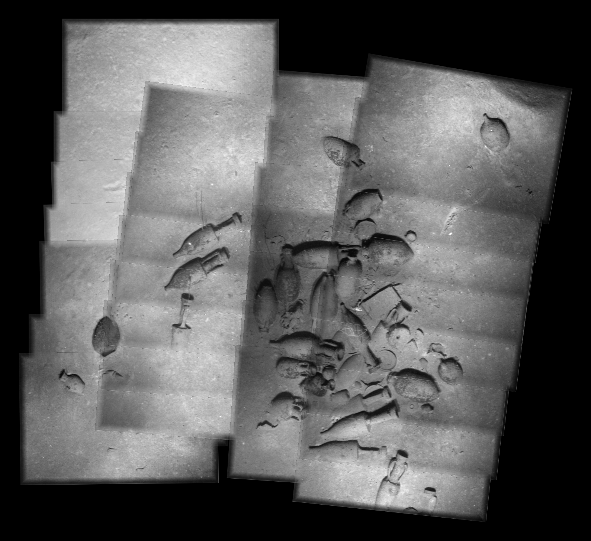
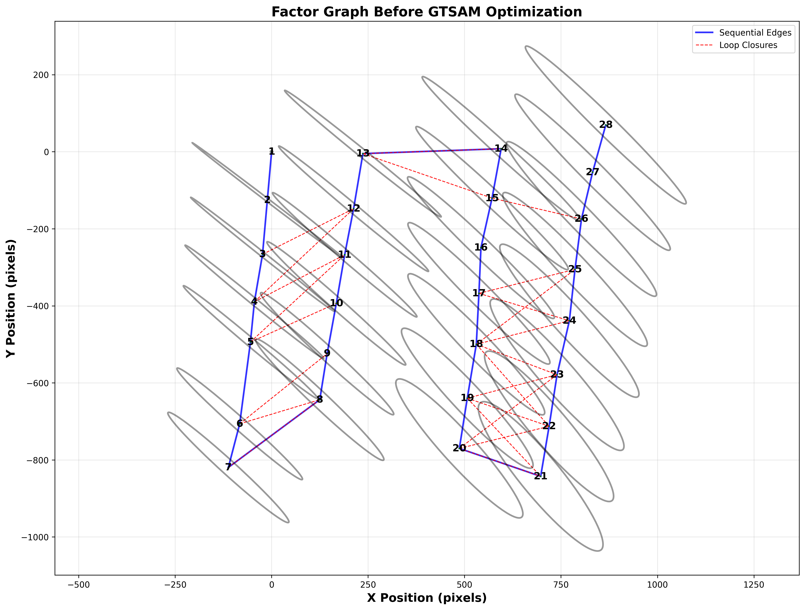
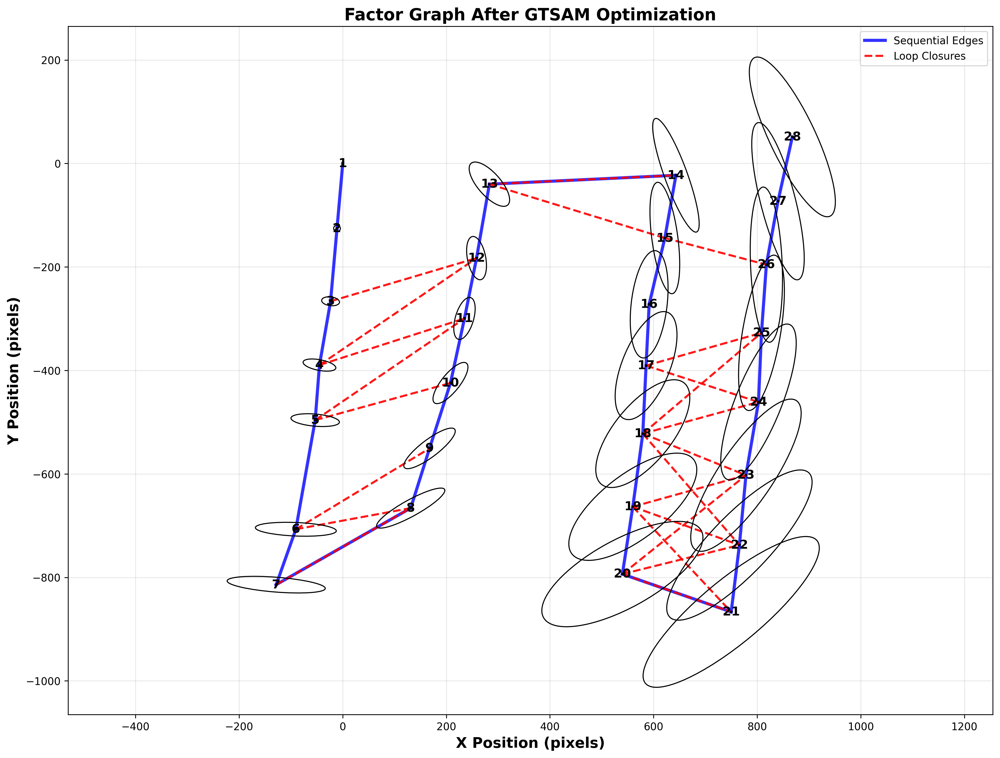

# Underwater Photomosaicing with Pose Graph SLAM

A complete implementation of vision-based SLAM for creating globally consistent underwater photomosaics from monocular camera sequences using pose graph optimization.

## Visual Results

### Photomosaic Comparison: Before and After Optimization

<table>
  <tr>
    <td><b>Before GTSAM Optimization</b></td>
    <td><b>After GTSAM Optimization</b></td>
  </tr>
  <tr>
    <td></td>
    <td></td>
  </tr>
  <tr>
    <td>Sequential odometry only<br/>Visible drift accumulation</td>
    <td>Globally consistent<br/>Loop closures applied</td>
  </tr>
</table>

*28-frame underwater mosaic from Skerki Deep shipwreck (500m depth). Left: 58px drift at mid-trajectory. Right: Corrected with pose graph optimization.*

### Factor Graph Evolution

<table>
  <tr>
    <td></td>
    <td></td>
  </tr>
  <tr>
    <td><b>Initial Estimates</b><br/>Accumulated uncertainty</td>
    <td><b>After Optimization</b><br/>34% uncertainty reduction</td>
  </tr>
</table>

## Motivation

### Real-World Problem

Underwater exploration and mapping at extreme depths (500m+) face critical challenges that make traditional localization impossible:

**Environmental Constraints:**
- **No GPS availability**: Satellite signals cannot penetrate water beyond a few meters
- **Light attenuation**: Exponential decay of light intensity causes feature tracking failures
- **Turbidity & particulates**: Water clarity issues reduce visual overlap between frames
- **Dynamic conditions**: Water currents cause camera motion blur and unstable trajectories

**Impact on Navigation:**
- Vision-based dead reckoning accumulates **unbounded drift** over time
- Sequential odometry alone produces misaligned, unusable maps
- Critical applications fail: archaeological documentation, infrastructure inspection, autonomous navigation

**Real-World Applications:**
1. **Marine Archaeology**: Document shipwrecks and underwater heritage sites (e.g., Skerki Deep wreck at 500m)
2. **Infrastructure Inspection**: Pipeline and offshore structure assessment without GPS
3. **Autonomous Underwater Vehicles (AUVs)**: Enable long-duration missions with reliable localization
4. **Scientific Surveys**: Create consistent maps of benthic habitats and geological formations

### Our Solution

This project implements **pose graph SLAM with loop closure detection** to:
- Detect revisited locations through non-sequential image matching
- Add global constraints that correct accumulated drift
- Jointly optimize all camera poses for global consistency
- Produce seamless, metrically accurate photomosaics

**Key Innovation:** Analytical Jacobian-based uncertainty quantification propagates measurement noise through the entire estimation pipeline, enabling information-weighted optimization.

### Technical Approach

**1. Feature-Based Image Registration**
- **SIFT detector**: Scale and rotation invariant features (69-912 keypoints/frame)
- **Lowe's ratio test**: False match rejection (threshold = 0.8)
- **RANSAC estimation**: Robust affine partial 2D with outlier rejection (5px threshold)
- **Result**: 46-86% inlier ratios across sequential pairs

**2. Uncertainty Quantification**
- Analytical **2N×8 Jacobian matrix** relates homography parameters to pixel errors
- **First-order covariance propagation**: σ²(J^T J)^(-1) from measurements to poses
- **Information matrix weighting**: Edge weights = Σ^(-1) reflect measurement confidence
- **Result**: Sub-pixel reprojection accuracy (0.25-2.21 px residuals)

**3. Loop Closure Detection**
- **Systematic non-sequential matching**: 41 candidate pairs tested
- **Geometric validation**: 40% inlier ratio threshold + RANSAC consensus
- **False positive rejection**: 16/41 pairs rejected for low overlap
- **Result**: 23 validated loop closures providing global constraints

**4. GTSAM Backend Optimization**
- **Factor graph formulation**: 28 pose nodes, 27 odometry + 23 loop closure factors
- **Levenberg-Marquardt solver**: Nonlinear least-squares with 100 iteration limit
- **Prior constraint**: Fixed anchor at origin (σ = [0.1, 0.1, 0.01])
- **Result**: 58px maximum drift correction, 34% uncertainty reduction

## Installation

### Setup
```bash
# Clone the repository
git clone https://github.com/yourusername/UnderwaterPhotomosaicing_SLAM.git
cd UnderwaterPhotomosaicing_SLAM

# Install dependencies
pip install -r requirements.txt
```
## Quick Start

### Run on 28-Image Dataset
```bash
python3 scripts/28_images.py

#view results
ls results/
```

## Project Structure

```
UnderwaterPhotomosaicing_SLAM/
│
├── src/
│   ├── __init__.py              # Package initialization
│   ├── pipeline.py              # Main SLAM pipeline (ImageFeatureMatching class)
│   ├── utils.py                 # Utility functions (data loading, statistics)
│   └── visualization.py         # Plotting functions (mosaics, graphs, trajectories)
│
├── scripts/
│   ├── 6_images.py              # Demo on 6-image subset
│   ├── 28_images.py             # Full 28-image pipeline
│   └── results/                 # Generated outputs
│       ├── *.png                # Visualizations (mosaics, factor graphs)
│       └── *.npy                # Numpy arrays (poses, covariances)
│
├── data/
│   ├── skerki_6/                # 6-frame test dataset (img_*.tif)
│   └── skerki_28/               # Full 28-frame dataset (img_*.tif)
│
├── requirements.txt             # Python dependencies
└── README.md                    # Project documentation
```


## Results

### Quantitative Performance

| Metric | Value | Description |
|--------|-------|-------------|
| **Dataset** | Skerki Deep shipwreck | 500m depth, 28 frames |
| **Sequential Success Rate** | 27/27 (100%) | All consecutive pairs matched |
| **Sequential Inlier Ratio** | 46.8% - 85.6% | Mean: 67.8% |
| **Loop Closures Detected** | 23/41 (56%) | Validated with 40% threshold |
| **Loop Closure Inlier Ratio** | 42.4% - 70.6% | Mean: 53.9% |
| **Reprojection Error** | 0.25 - 2.21 px | Sub-pixel accuracy |
| **Max Drift Correction** | 58.2 pixels | At Node 13 (mid-trajectory) |
| **Mean Drift Correction** | 35.3 pixels | Across all 28 poses |
| **Uncertainty Reduction** | 34.4% | From GTSAM optimization |
| **Mosaic Size (before)** | 1589 × 1457 px | Sequential odometry only |
| **Mosaic Size (after)** | 1721 × 1514 px | With loop closures |

## References

### Key Papers

1. **SIFT**: Lowe, D. G. (2004). "Distinctive Image Features from Scale-Invariant Keypoints." *International Journal of Computer Vision*, 60(2), 91-110.

2. **RANSAC**: Fischler, M. A., & Bolles, R. C. (1981). "Random Sample Consensus: A Paradigm for Model Fitting with Applications to Image Analysis and Automated Cartography." *Communications of the ACM*, 24(6), 381-395.

3. **Pose Graph SLAM**: Grisetti, G., Kümmerle, R., Stachniss, C., & Burgard, W. (2010). "A Tutorial on Graph-Based SLAM." *IEEE Intelligent Transportation Systems Magazine*, 2(4), 31-43.

4. **GTSAM**: Dellaert, F., & Kaess, M. (2017). "Factor Graphs for Robot Perception." *Foundations and Trends in Robotics*, 6(1-2), 1-139.

